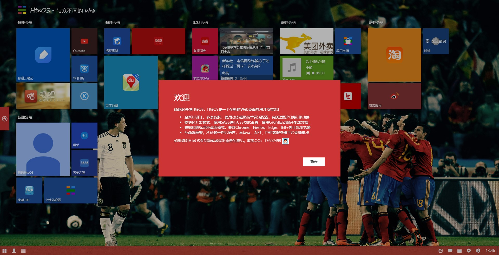
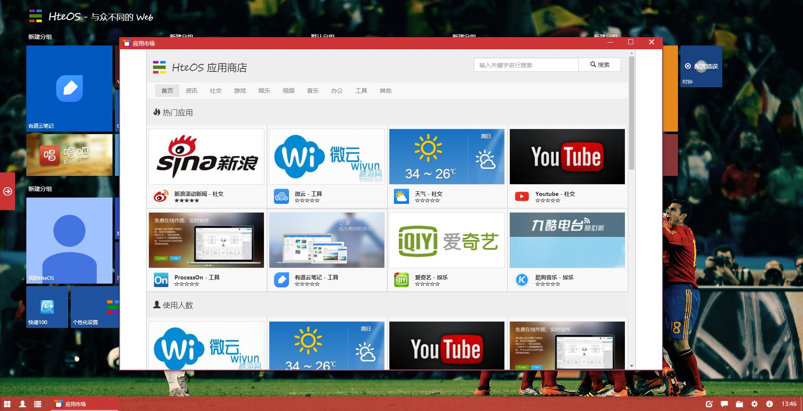
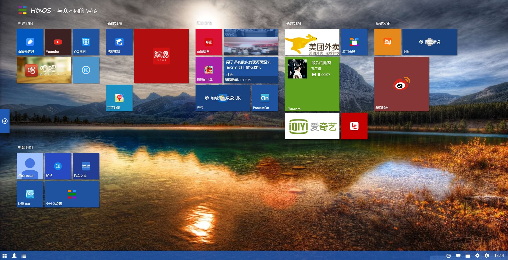
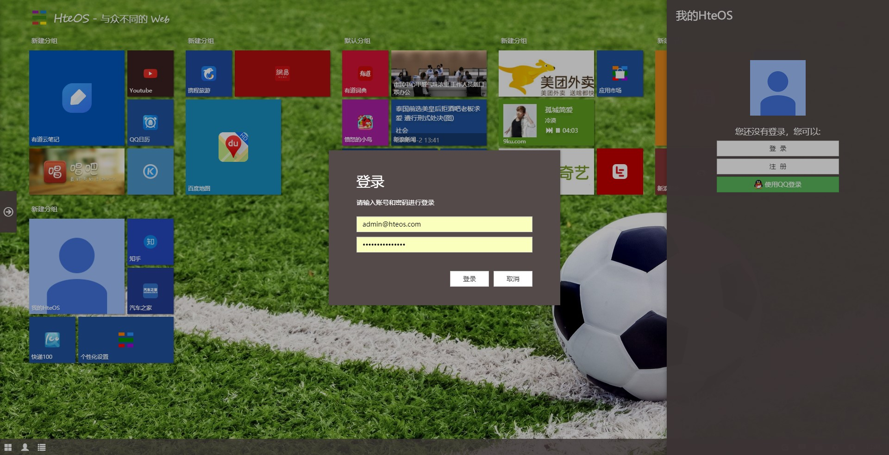

# HteOS
[HteOS](http://www.hteos.com)HteOS是一款全新的Web桌面应用开发框架，Win10 Metro UI风格设计，响应式设计适配PC端、移动端所有设备，广泛应用于Web应用开发，移动应用开发、业务系统、智能电视开发。
## 简介
本项目是基于HteOS4.0构建的Web桌面应用，后台基于SpringBoot2构建。在线演示地址：[http://demo.hteos.com](http://demo.hteos.com)

整个项目有以下模块

| 模块 | 描述 |
| ------ | ------ |
| hteos-admin | 后台管理系统，可以维护应用和查看报表 |
| hteos-biz | 业务模块，涵盖所有web的业务|
|hteos-demo|Web桌面后台，提供API接口供Web桌面访问|
|hteos-demo-web|Web桌面文件，静态前台文件，可以直接运行|
|hteos-framework|公共框架组件|
## 如何启动
### 第一步，新建数据库，导入SQL脚本db\hteos4.sql
### 第二步，修改配置文件
~~~
hteos-admin\src\main\resources\application.yml
hteos-demo\src\main\resources\application.yml
~~~
修改这两处的配置，主要是修改数据库链接和账号密码
### 第三步 启动应用
~~~
hteos-demo\src\main\java\com\hteos\demo\DemoApplication.java
~~~
使用这个类进行启动，端口8080，端口号可以修改但是需要
### 第四步 启动前台
~~~
hteos-demo-web\app.html
~~~
在idea中可以直接右键运行这个文件

## 系统截图

## 版权声明
本项目基于MIT授权协议，可以任意修改。但是HteOS基于商业授权协议，您可以用于学习或者交流，未经授权不得用于任何商业项目。

## QQ交流群：313060695